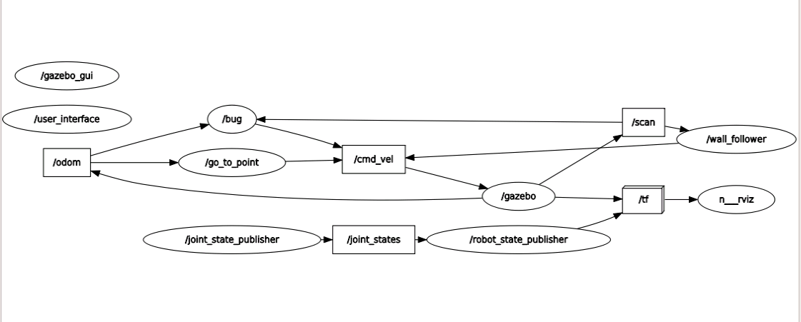
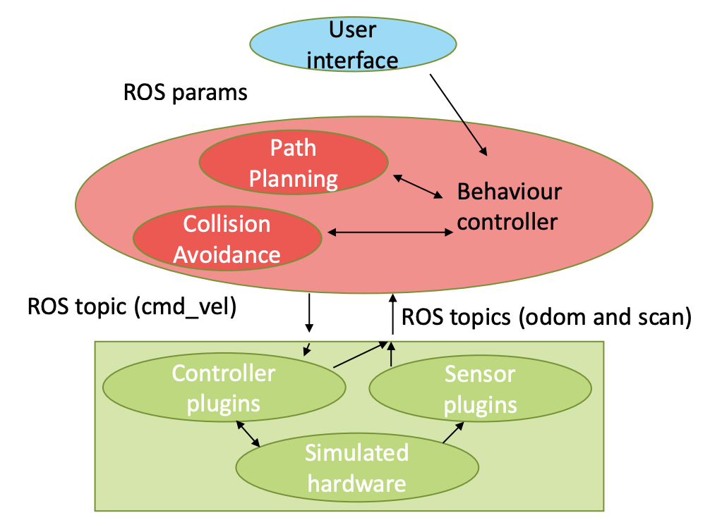

# Research Track I - final assignment

Name: Litong Huang 
Student ID: 5058374

## Description of the assignmnet

1. The robot should get the user input, then move randomly to one of the target positions [(4,3);(4,2);(4,7); (5,7); (5,3); (5,1)] by implementing a random position server. For the user interface, it should ask for the user command and display the robot position, robot state, and the distance from the obtacle. 
2. After reaching a target position, the robot will ask for the next postition and make sure that it is one of the six possible positions. 
3. The robot can move around external walls. 
4. Finally, the robot will stop at the last position. 

### Keep in mind:
- Before switching to state 3 and 4, the system should wait for the robot to finish state 1 or 2 in reaching the target position.
- Sending the goal to the topic by sending a message:
`rostopic pub /move_base/goal move_base_msgs/MoveBaseActionGoal`
- Adding `'map'` to `frame_id `, and set the orientation `'w'` to 1.
- Set the target x and y position to:
```
   goal.target_pose.pose.position.x
   goal.target_pose.pose.position.y
```

## Computational graph of the system (`rqt_graph`)




## Description of the content of the package
Bsed on the above computational graph of the system, 

### Stimulate the robot and its physical interaction with the environment:

- `/gazebo_gui`
- `/gazebo`
- `/joint_state_publisher`
- `/joint_states`
- `/robot_state_publisher`
- `/tf`
- `/r_viz`

### Implement the actual robot controller:

- `/cmd_vel`
- `/odom`
- `/bug`
- `/go_to_point`
- `/scan`
- `/wall_follower`

### User interface module: interact with the robot by setting some parameters
- `/user_interface`


## Software Architecture




## Instructions about how to run to code

Use `roslaunch`

```
roslaunch final_assignment simulation_gmapping.launch

roslaunch final_assignment move_base.launch
```

## Robot Behavior implemented
1. To move to one of the six random positions, the node `/Robot` calls for the server and also publishes the target position using `/move_base`.

2. As soon as the robot reaches the target position, `/user_interface` is called. The robot will move to the next target if it is within one of the six positions, or asking for the command again.

3. After completing state 1or 2, the node `/Robot` calls for the robot controller `/wall_follower`, then the robot can change the state.

4. After executing the command from the `/user_interface`, the robot stops at the last position.


## Limitations and possible Improvements

The system limitation includes that sometimes the robots cannot avoid hitting or going closer to the obstacles because it is not aware of that. Also, when reaching the target position, the robot will constantly change it path because it is off the path and has to keep adjusting to the direction. To better estimate and optimize the path, we can possibly using amcl.


